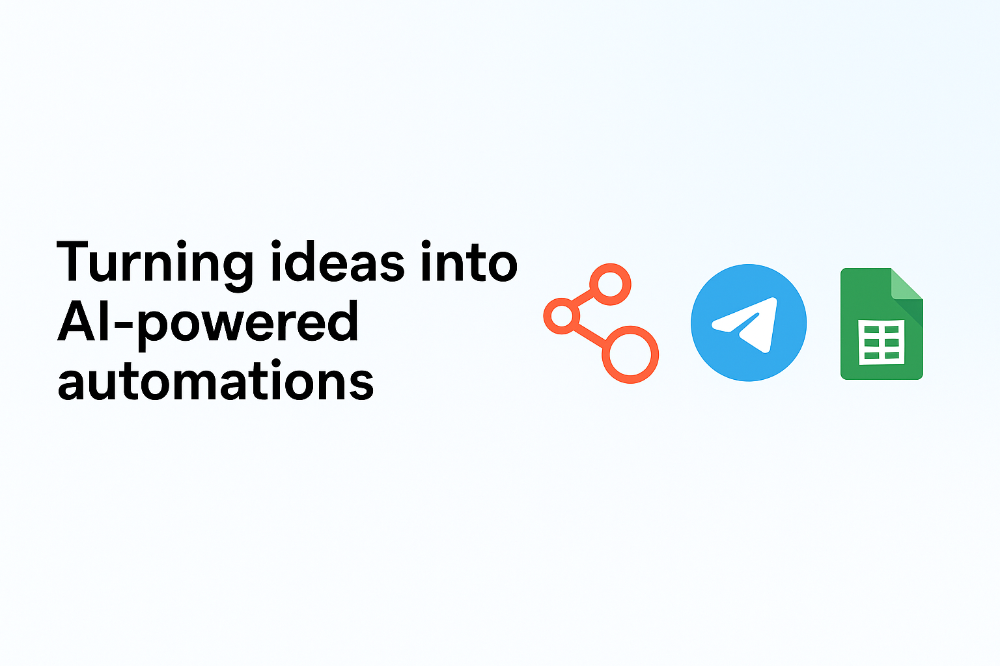

  

<h1 align="center">👋 Salut, moi c’est Sterve</h1>
<h3 align="center">Turning ideas into AI-powered automations ⚙️</h3>

---

### 🚀 À propos de moi
Passionné par la **création de solutions intelligentes** et l’automatisation de tâches répétitives,  
j’aide les particuliers et entreprises à **transformer leurs idées en automatisations IA concrètes**.  

🔹 Spécialisé en **n8n**, **Telegram bots** et **intégrations Google Sheets / Notion / PostgreSQL**  
🔹 Toujours en quête d’optimisation : gain de temps, productivité et impact réel.  
🔹 Basé en Tunisie 🌍, avec un esprit d’entrepreneur africain déterminé à bâtir une empreinte numérique mondiale.  

---

### 🧩 Compétences principales

| Domaine | Détails |
|----------|----------|
| ⚙️ Automatisation | n8n • Webhooks • APIs • JSON |
| 🤖 Chatbots | Telegram • GPT Assistants |
| 🗄️ Bases de données | PostgreSQL • Google Sheets • Notion API |
| ☁️ Intégrations | Open-Meteo • Google Drive • Tixu.ai |
| 🧠 IA & No-Code | ChatGPT • Prompt Engineering • Automations IA |

---

### 💼 Projets en vedette

#### 🌾 [n8n Agro Telegram Bot](https://github.com/sterve9/n8n-agro-telegram-bot)
> Assistant IA pour ferme agricole (n8n + Telegram + Open-Meteo + Google Sheets)  
> 📊 Automatisation des rapports météo, interventions et recommandations agricoles.

#### 🔗 [RSS → PostgreSQL Automation](https://github.com/sterve9/RSS-to-PostgreSQL)
> Projet d’automatisation des flux RSS vers une base de données PostgreSQL pour la veille et la gestion de contenu.  
> 🧩 Connecté via n8n pour la collecte et la synchronisation automatique des données.

---

### 🛠️ Outils favoris

  
  
  
  
  
  

---

### 📫 Me contacter

  
  

---

### 💡 Citation favorite
> “L’automatisation n’est pas la fin du travail, mais le début de la créativité.”  

---

  💼 Profil maintenu par <strong>Sterve</strong> | 🧠 Automatisations IA & Bots intelligents  

